# Gallery

Every comparison image in this repo, kept out of the README so that page stays short. Nothing
here is a measurement -- those live in [BENCHMARKS.md](BENCHMARKS.md). These exist because
LPIPS answers "how far did it move", not "is it worse", and the two come apart: W4A4 shifts
the sampling trajectory, so a checkpoint can score a large distance and still look fine, or a
small one and mangle a line of text.

* [Fidelity sheets, no LoRA](#fidelity-sheets-no-lora) -- 16 prompts x 7 checkpoints x 2 seeds
* [Fidelity sheets, with a LoRA](#fidelity-sheets-with-a-lora) -- the same, under `bloomgirls-ultrarealism`
* [Rank sweep, refined vs not](#rank-sweep-refined-vs-not)
* [Identity-edit LoRA](#identity-edit-lora)
* [Single-prompt stress tests](#single-prompt-stress-tests)

**How to read the sheets.** They are wide -- open one full size, they are unreadable at page
width. Columns run left to right in accuracy order: **BF16 reference** first, then no
low-rank branch, then rising rank, ending with the activation-aware build. Rows are two
seeds. So anything that differs between the two rows of a *single* column is sampling
variance, not a property of the checkpoint -- and if a difference between columns is smaller
than the difference between rows, it is not a difference.

## Fidelity sheets, no LoRA

Built with `tools/contact_sheet.py` from the same renders `tools/fidelity_bench.py score` measures, so every image here has a number behind it in
[Test 3 and Test 4](BENCHMARKS.md#test-3--paired-lpips-fidelity-with-and-without-a-lora).

**01_dense_text** -- Three lines of small chalkboard text. The hardest cell in the set: read the prices.

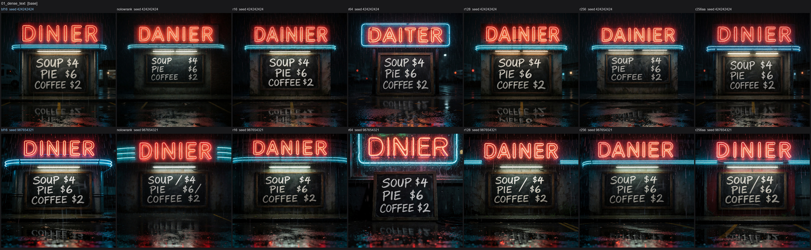

**02_curved_text** -- Two large words wrapped around a cup. Every checkpoint gets this; it is the easy control.

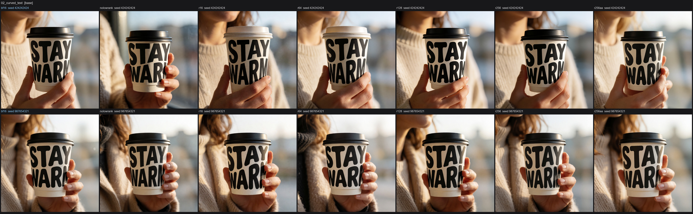

**03_hands_detail** -- Finger placement on the strings, and whether the motion-blurred bow holds together.

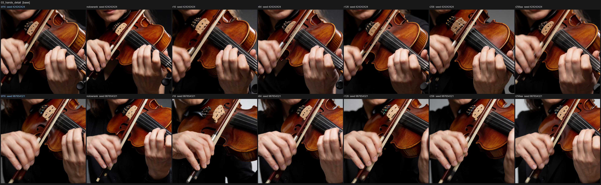

**04_crowd_faces** -- Dozens of small faces. Look for melted or duplicated ones rather than at the whole frame.

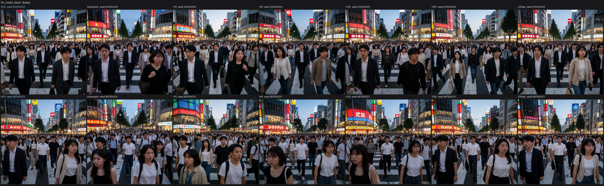

**05_symmetry_pattern** -- Repeating geometry. Breaks in the tiling are far easier to see than colour drift.

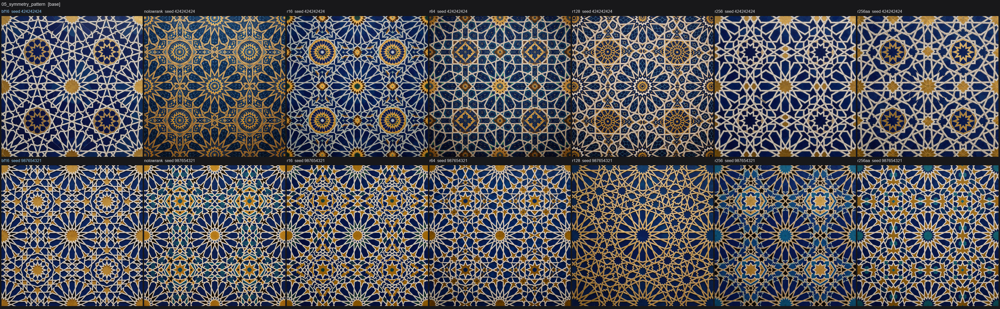

**06_multi_subject** -- Two people acting at once -- tweezers in one pair of hands, sauce in the other.

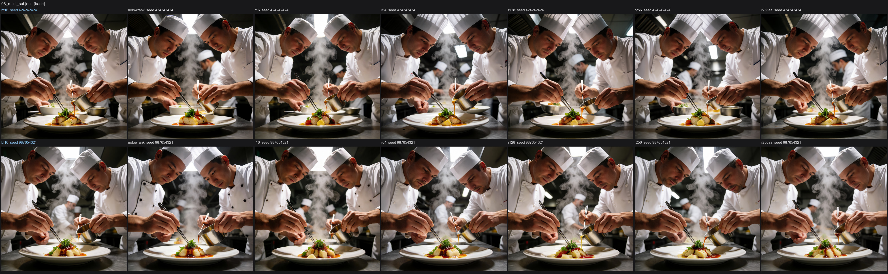

**07_reflections_glass** -- Condensation and bokeh reflected through liquid. High frequency, little structure.

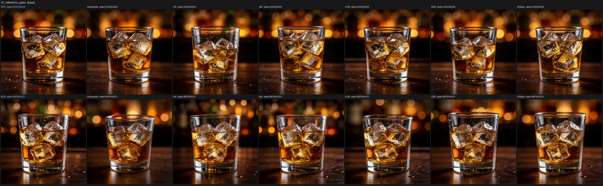

**08_logo_typography** -- Serif signage on curved chrome: text and specular highlight in the same place.

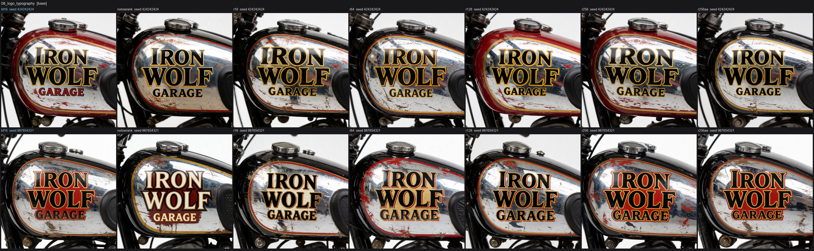

**09_counting_objects** -- Seven apples, three pears. Miscounting is a structural failure, not a detail one.

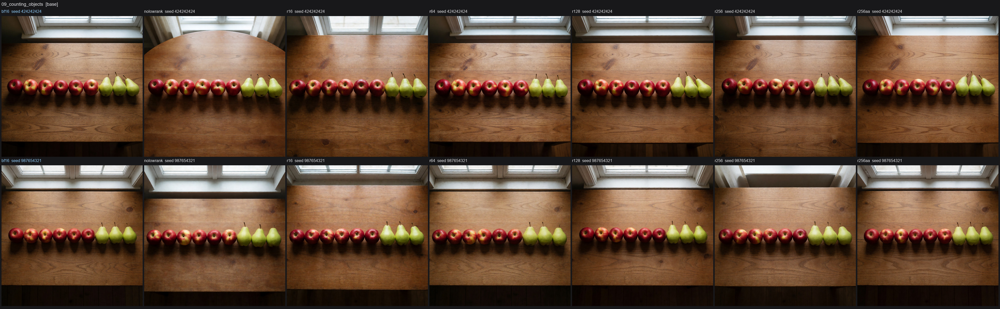

**10_complex_scene** -- Dense painterly scene. Composition should be identical; brushwork will not be.

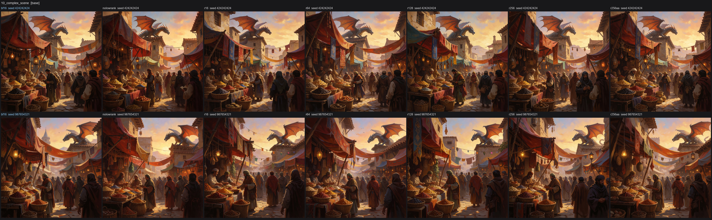

**11_portrait_woman** -- Skin texture, freckles, catchlights. Where a photographic LoRA earns its keep.

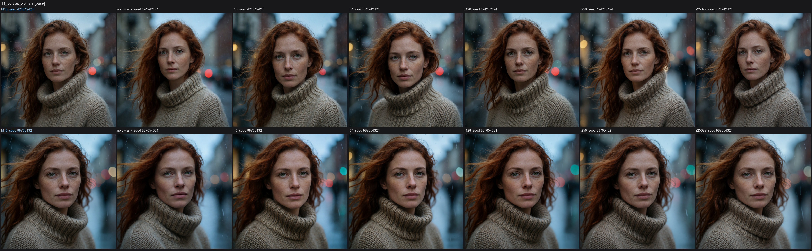

**12_person_holding_sign** -- Handwritten marker text on cardboard at arm's length -- text plus a full body.

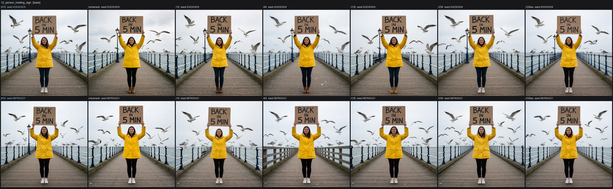

**13_two_people_interaction** -- Two faces mid-expression, and the hand-off between them.

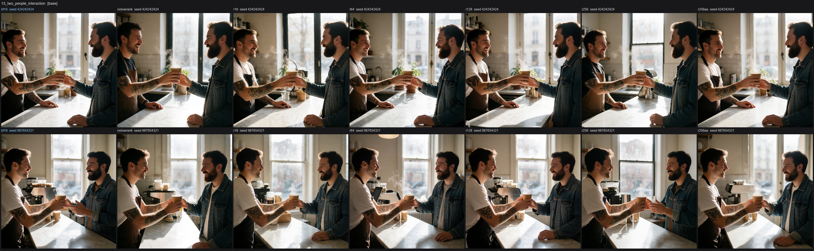

**14_hands_and_face** -- Hands, lips and a reflected eye in one frame at extreme close-up.

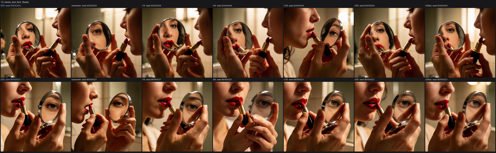

**15_full_body_fashion** -- Fabric folds under hard side light, and whether the stride survives.

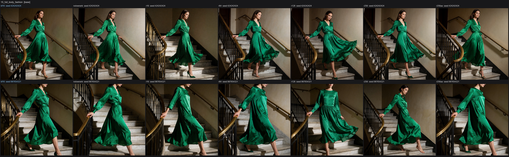

**16_group_selfie** -- Four faces at once, plus the arm geometry of whoever is holding the phone.

## Fidelity sheets, with a LoRA

The same 16 prompts and seeds with `bloomgirls-ultrarealism-krea2_4k` at strength 1.0,
applied through this repo's LoRA node. The BF16 column carries the LoRA too -- the
comparison is quantized+LoRA against BF16+LoRA, which is the question the repo's earlier
LoRA benchmark never asked.

**01_dense_text** -- Three lines of small chalkboard text. The hardest cell in the set: read the prices.

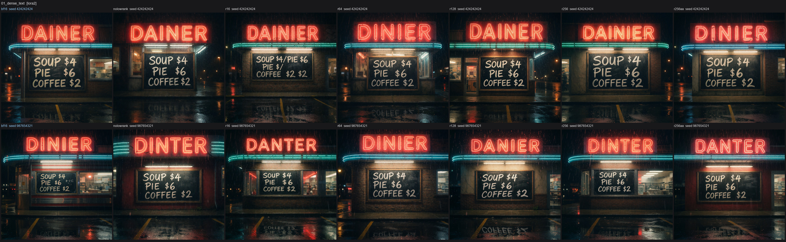

**02_curved_text** -- Two large words wrapped around a cup. Every checkpoint gets this; it is the easy control.

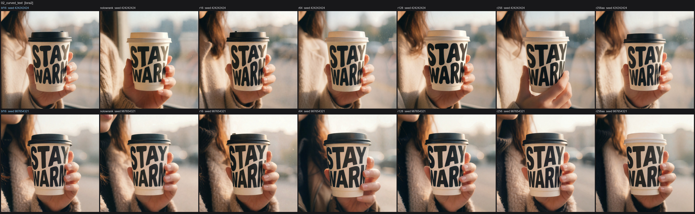

**03_hands_detail** -- Finger placement on the strings, and whether the motion-blurred bow holds together.

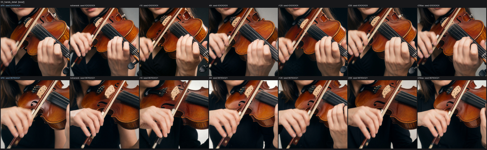

**04_crowd_faces** -- Dozens of small faces. Look for melted or duplicated ones rather than at the whole frame.

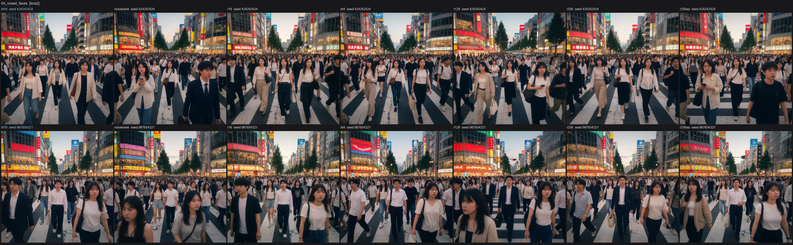

**05_symmetry_pattern** -- Repeating geometry. Breaks in the tiling are far easier to see than colour drift.

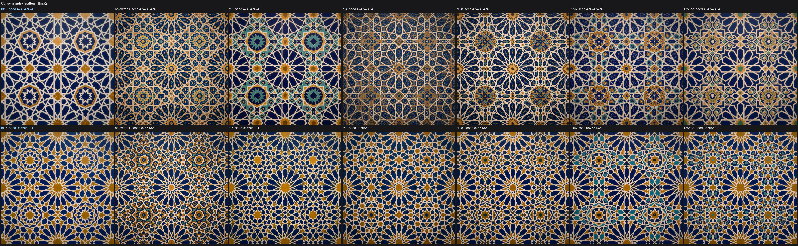

**06_multi_subject** -- Two people acting at once -- tweezers in one pair of hands, sauce in the other.

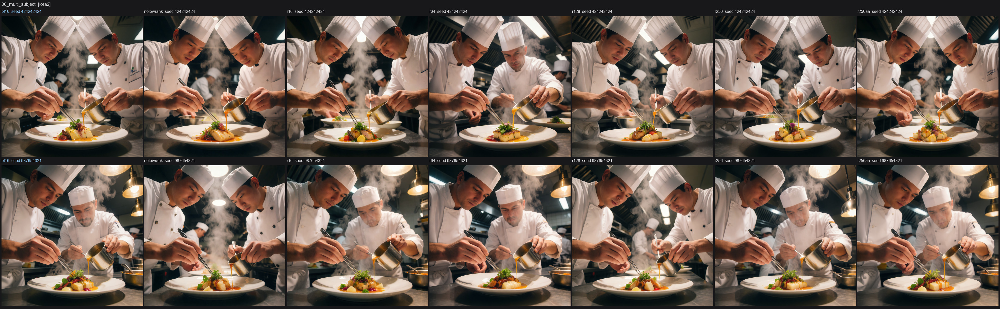

**07_reflections_glass** -- Condensation and bokeh reflected through liquid. High frequency, little structure.

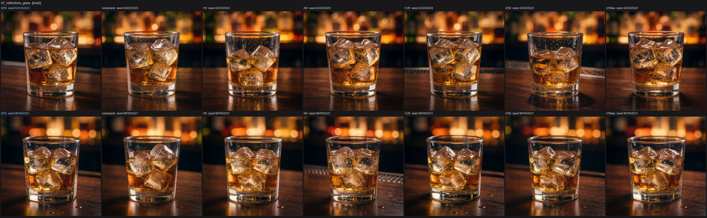

**08_logo_typography** -- Serif signage on curved chrome: text and specular highlight in the same place.

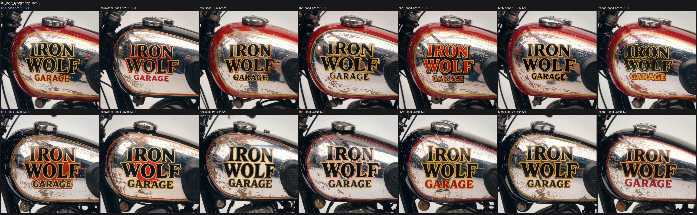

**09_counting_objects** -- Seven apples, three pears. Miscounting is a structural failure, not a detail one.

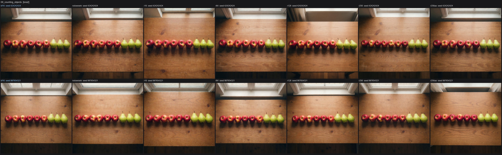

**10_complex_scene** -- Dense painterly scene. Composition should be identical; brushwork will not be.

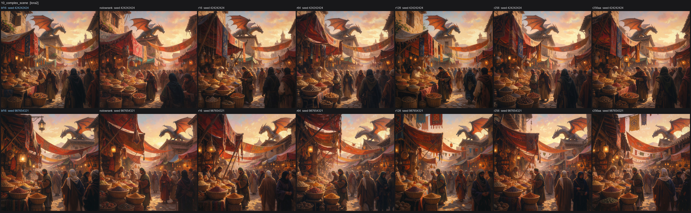

**11_portrait_woman** -- Skin texture, freckles, catchlights. Where a photographic LoRA earns its keep.

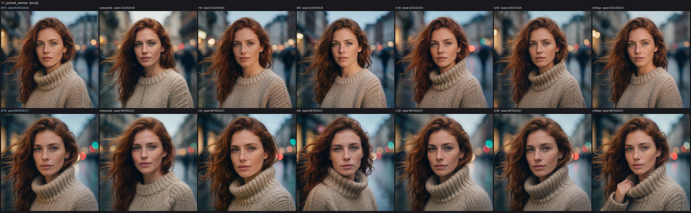

**12_person_holding_sign** -- Handwritten marker text on cardboard at arm's length -- text plus a full body.

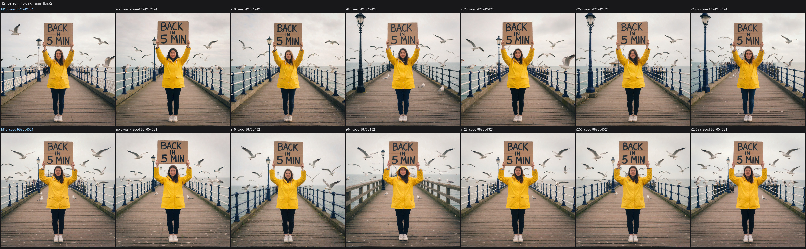

**13_two_people_interaction** -- Two faces mid-expression, and the hand-off between them.

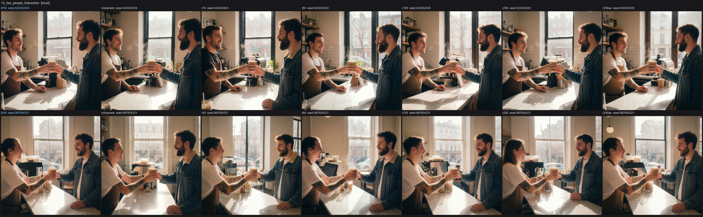

**14_hands_and_face** -- Hands, lips and a reflected eye in one frame at extreme close-up.

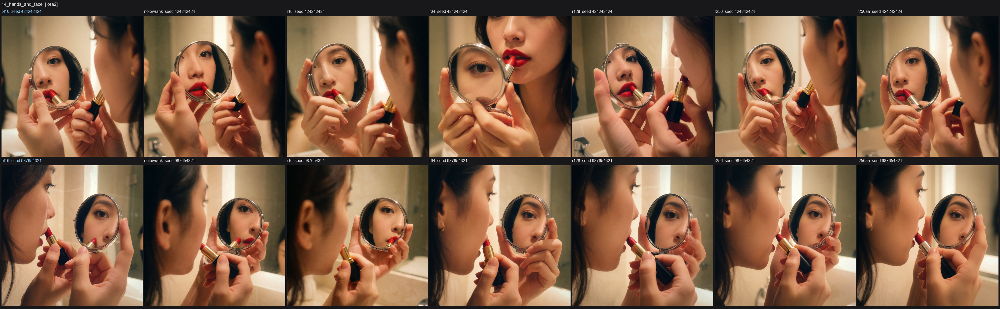

**15_full_body_fashion** -- Fabric folds under hard side light, and whether the stride survives.

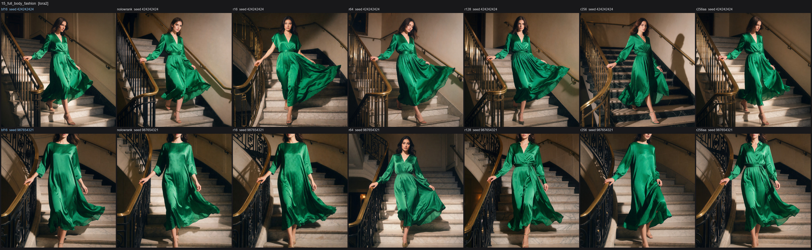

**16_group_selfie** -- Four faces at once, plus the arm geometry of whoever is holding the phone.

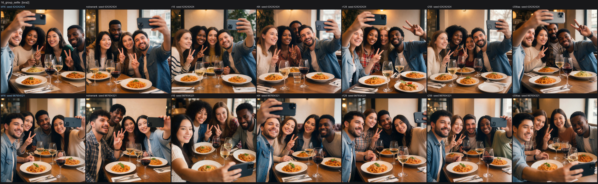

## Rank sweep, refined vs not

Ten prompts across rank 16 through 256, refined and non-refined, from the sweep documented in
[Test 1](BENCHMARKS.md#test-1--text-to-image-rank-sweep). Speed tables and the prompts
themselves are there; these are the images.

## Identity-edit LoRA

Six edits on three real photographs through the
[Krea 2 Identity Edit LoRA](https://github.com/lbouaraba/comfyui-krea2edit), same rank sweep.
Details in [Test 2](BENCHMARKS.md#test-2--krea2edit-lora-identity-preserving-editing).

| woman 1 | woman 2 | woman 3 |
|---|---|---|
|  |  |  |

## Single-prompt stress tests

The two early comparisons, one seed each, across all nine formats tried during development
(FP8, INT8 and rank 32 are here for reference; they were never uploaded). One seed is not a
ranking -- read these as "what does this format do to this image", not "which is best".

### Hard case: dense multi-line text

A rainy neon diner sign with a three-line handwritten chalkboard menu.

| BF16 (reference) | INT8 + convrot |
|---|---|
|  |  |

| W4A4, no low-rank branch | SVDQuant rank 128 |
|---|---|
|  |  |

What happened at this one seed: BF16, FP8 and INT8 render the menu correctly; W4A4 with no
branch duplicates a word; rank 16 is correct but shifts a nearby sign's colour; rank 32
duplicates a line; rank 64 gets a digit wrong; rank 128 lands closest to BF16; rank 256 swaps
two digits. That is not a rank ordering -- it is seed sensitivity, which is precisely why the
paired multi-seed sheets above exist.

All nine variants for this prompt

[`examples/neon_sign_text_test/`](examples/neon_sign_text_test) -- file names match the config
names used in the benchmark tables.

### Easy case: large text, two subjects, low angle

Two people, a low camera angle, and two words of large curved text on a held object. Every
checkpoint renders the text correctly here, down to W4A4 with no branch; only fine composition
details vary.

| BF16 (reference) | SVDQuant rank 64 |
|---|---|
|  |  |

All nine variants for this prompt

[`examples/ice_cream_multisubject_test/`](examples/ice_cream_multisubject_test)

**Across both:** for large signage text or no text, any checkpoint here works. For dense small
text the low-rank branch helps and does not fully close the gap to INT8 -- `quantize_krea2.py
--format int8` is the better choice if that is your main use case.
